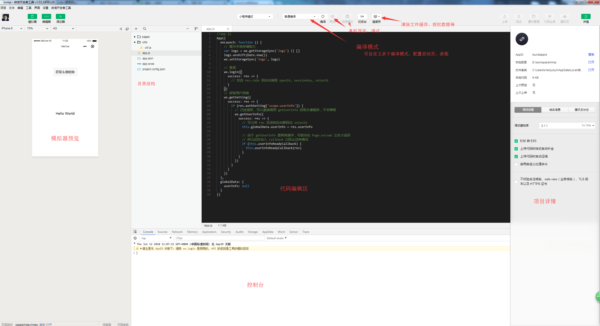

# 小程序
## 小程序帐号申请
[小程序注册链接](<https://mp.weixin.qq.com/wxopen/waregister?action=step1> )

[小程序管理平台]( [https://mp.weixin.qq.com](https://mp.weixin.qq.com/) )

> 注册成功小程序之后，登录到小程序管理平台，在开发设置中可以查看到小程序的**appID**，我们在开发工具中新建小程序项目的时候需要填写它。

## 小程序开发工具

[开发者工具](https://mp.weixin.qq.com/debug/wxadoc/dev/devtools/download.html?t=2018626)

> 开发者工具可以编写小程序代码（真心不好用,没有emmet,经常会有些莫名其妙的bug需要重启才能恢复）。可以本地调试或连接真机调试。可以调试公众号页面

## 小程序创建

打开开发者工具，点击新建项目，设置一下项目目录，如果有appID的话填写appID，没有的话可选择体验；项目名称默认是项目目录的名称，可自行修改；选择“建立普通快速启动模板”；最后点击确定。这样一个小程序的项目就创建好了。


## 基本目录结构

> 小程序包含一个描述整体程序的 app 和多个描述各自页面的 page。

小程序主体包括三个文件,且必须置于根目录: 
- ```app.js // 小程序主逻辑```
- ```app.json // 小程序公共配置```
- ```app.wxss // 小程序公共样式表```

``` 
├─ pages // 小程序页面目录
│   ├─ index
│   └─ log
├─ utils // 工具方法
├─ app.js
├─ app.json
├─ app.wxss
└─ project.config.json // 开发工具配置
```
小程序页面由四个文件组成:
  - ``.wxml``文件。  
    必须使用小程序支持的组件。如: ``view``、 ``text`` 、``icon``、``switch``等等，具体有哪些组件可以查阅官方文档。ps: 小程序1.6.3版本以上支持自定义组件；同时1.9.6版本开始支持插件的开发与使用。
    + 数据绑定  
      wxml模版值使用双花括号。不管是插入内容或者在组件属性中传值都必须如此。如：
      ```html
        <view id="item-{{id}}" data-index="{{index}}" wx:if="{{condition}}">{{ message }}</view>
      ```
      在模版中可以进行简单的运算。支持的方式有： 三元运算、算术运算、逻辑判断、字符串运算、对象取值,也可以直接创建数组或者对象。支持扩展运算符  
    **注意**：在模块中创建数组对象时，如果花括号与引号之间有空格，会被当成字符串解析，比如``wxfor="{{[1,2]}} "``最终输出的是1 、逗号、2、空字符串四项
    + 列表渲染  
      使用```wx:for```属性绑定一个数组或对象。默认数组的当前项的下标变量名默认为 ``index``，数组当前项的变量名默认为 ``item``,可以使用``wx:for-item``指定数组当前元素的变量名,使用``wx:for-index``指定数组当前下标的变量名
      ```html
        <view wx:for="{{[1, 2]}}">{{index + '-' + item}}</view>
        <view wx:for="{{[1, 2]}}" wx:for-item="element" wx:for-index="idx">{{idx + '-' + element}}</view>
        <block wx:for="5">
          <text></text> // todo
        </block>
      ```

  - ``.wxss``文件。  
  书写的规则与正常css基本一致，少部分选择器如``*``是不支持的。在小程序中，我们可以使用rpx单位。以750的设计稿定，可不需要换算直接1rpx = 1px
  - ``.js``文件。  
  每一个页面的js文件必须调用页面构造器函数``Page``，并传入一个object
      ``` javascript
      Page({
        data: { // 参与页面渲染的数据
          logs: []
        },
        onLoad: function () {
          // 页面渲染后 执行
        }
      })
      ```
  - ``.json``文件。  
  对当前页面窗口进行单独配置，只能使用app.json中window字段的配置内容。具体配置项请查阅[官方文档-配置][wxconfig]

    **注意：为了方便开发者减少配置项，描述页面的四个文件必须具有相同的路径与文件名。**

      > Page() 函数用来注册一个页面。接受一个 object 参数，其指定页面的初始数据、生命周期函数、事件处理函数等。object 内容在页面加载时会进行一次深拷贝，需考虑数据大小对页面加载的开销。所以这块地方要注意一下，小程序从后台返回前台的时候，也会重新拷贝一份。所以在Page函数外面定义变量的时候要注意到这一点。

## 配置

- 全局配置  
  在app.json中可以全局配置页面文件的路径、窗口表现、设置网络超时时间、设置多 tab 等。  
  此处仅贴出常用部分配置，具体配置项请查阅[官方文档-配置][wxconfig]:
  ```javascript
  {
    // 页面配置
    "pages": [
      "pages/index/index",
      "pages/logs/logs"
    ],
    // 窗口配置
    "window":{
      "navigationBarBackgroundColor": "#fff", // 导航栏背景色
      "navigationBarTitleText": "Just do IT", // 导航栏标题
      "navigationBarTextStyle":"black", // 导航栏字体颜色
      "navigationStyle": "default", // 导航栏样式 默认default,自定义导航栏样式时设置为custom
      "backgroundColor": "#fff", // 窗口背景色
      "backgroundTextStyle":"light", // 下拉loading样式,仅支持 dark/light
      "enablePullDownRefresh": false, // 是否开启下拉刷新
      "onReachBottomDistance": 50 // 上拉触底事件触发时距页面底部距离，单位为px
    },
    // 底部tab配置
    "tabBar": {
      "color": "#000", // tab上字体颜色
      "selectedColor": "#fff", // tab激活时的字体颜色
      "backgroundColor": '#fff', // tab背景色
      "borderStyle": "black", // tabbar上边框的颜色， 仅支持 black/white
      // list是tab页的配置项，开启tabbar之后，List只能配置2-5个tab页
      "list": [{
        "pagePath": "pages/index/index",
        "text": "首页",
        "iconPath": 'index.png', // icon大小限制40kb,建议尺寸81*81,当position的值为top时，此项无效
        "selectedIconPath": 'index-active.png' // tab激活时的icon
      }],
      "position": "bottom" // tabbar在页面中的位置。可选值 bottom、top
    },
    // 超时设置
    "networkTimeout": 60000,
    "debug": true
  }

  ```

- 路由配置  
小程序的路由配置，首先需要在pages目录下创建好对应的页面文件，如``pages/index/index.wxml``、``pages/index/index.wxss``、``pages/index/index.js`` ；然后在根目录```app.json```中做对应配置
  ``` javascript
  // app.json
  {
    "pages": [
      "pages/index/index"
    ]
  }
  ```

## 小程序生命周期

App中的生命周期函数


Page中的生命周期函数
- onLoad: 页面加载

  一个页面只会调用一次，可以在 onLoad 中获取打开当前页面所调用的 query 参数。
- onShow: 页面显示

  每次打开页面都会调用一次。
- onReady: 页面初次渲染完成

  一个页面只会调用一次，代表页面已经准备妥当，可以和视图层进行交互。
  对界面的设置如wx.setNavigationBarTitle请在onReady之后设置。详见生命周期
- onHide: 页面隐藏

  当navigateTo或底部tab切换时调用。
- onUnload: 页面卸载

  当redirectTo或navigateBack的时候调用。


## 其他
1. 在app.json中配置window.navigationStyle = 'custom'可定义导航栏样式,这时候页面的可编辑区域包括了顶部导航。仅保留右侧的按钮。

[wxconfig]: https://developers.weixin.qq.com/miniprogram/dev/framework/config.html